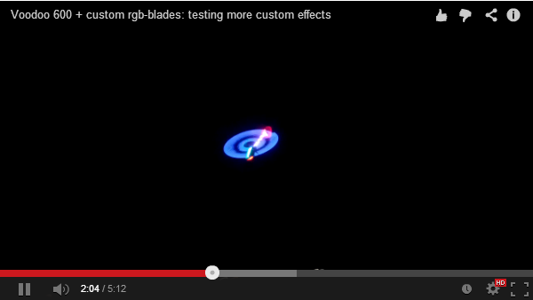
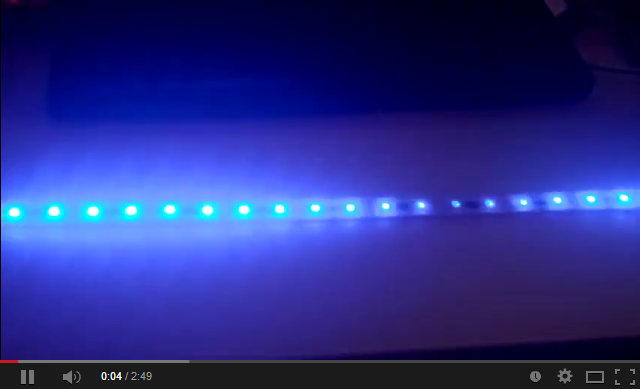

dRGBblades
==========

dRGBblades is a small pcb to drive a lpd8806-based led stripe on a rc-helicopter blade with a 1s lipo

It consists of a DC/DC-converter that converts the 1s lipo input voltage (3.3-4.2V) to a 5V/2A output
to power the led stripe and a atmel attiny84 to control the digital side of the stripe.

The DC/DC-converter is based on a LT3436 (http://cds.linear.com/docs/en/datasheet/3436fa.pdf) switching
regulator.

dRGBblades on a voodoo 600 installed on radix 600mm blades:

dRGBblades stripe only test video:

